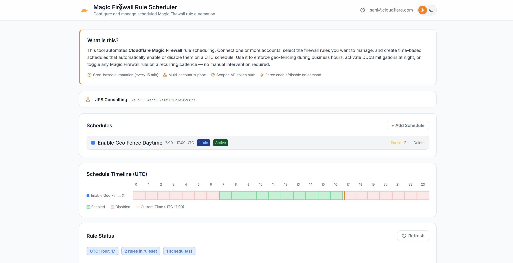

# Worker MFW Automation

A Cloudflare Worker that automates Magic Firewall rule scheduling. Configure multiple accounts, auto-discover rulesets, create schedules that enable/disable specific firewall rules on a time-based cadence, and visualize everything in a web dashboard.



## Features

- **Multi-account support** — manage multiple Cloudflare accounts from a single dashboard
- **Auto-discovery** — automatically detects the Magic Firewall ruleset via the `magic_transit` phase entrypoint (no manual ruleset ID entry required)
- **Rule enumeration** — fetches and displays all rules in the ruleset with a multi-select picker
- **Multiple schedules** — create multiple schedules per account, each targeting different rules with independent enable/disable time windows
- **Pause/resume schedules** — temporarily pause a schedule without deleting it; paused schedules are skipped by the cron handler
- **Timeline visualization** — color-coded timeline showing enabled (green) and disabled (red) hours per schedule with a current time marker
- **Manual override** — force enable/disable all scheduled rules with one click
- **Token permission checker** — built-in "Test Token" button verifies API token permissions against the Cloudflare API
- **Activity log** — tracks all actions (schedule changes, manual toggles, cron runs)
- **Cloudflare Access** — protected by Cloudflare Access for authentication
- **Dark/light theme** — toggle between dark and light mode

## API Token Permissions

This worker authenticates to the Cloudflare API using a scoped **API Token** (via `Authorization: Bearer <token>` header). Create an API Token in the Cloudflare dashboard under **My Profile > API Tokens > Create Token**.

### Required Token Permissions

When creating the token, scope it to the target account and grant the following permissions:

| Permission | Access | Purpose |
|---|---|---|
| **Magic Firewall Packet Filter** | Edit | Auto-discover the `magic_transit` phase entrypoint ruleset, enumerate rules, and toggle rule enabled state |
| **Account Rulesets** | Edit | List, view, and update rulesets at the account level |

> **Note:** "Edit" access includes read. You do not need to add separate read-only entries.

### How It Works

1. **Ruleset discovery** — The worker calls `GET /accounts/{account_id}/rulesets/phases/magic_transit/entrypoint` to find the Magic Firewall root ruleset.
2. **Rule enumeration** — Rules are returned as part of the entrypoint response, or fetched via `GET /accounts/{account_id}/rulesets/{ruleset_id}`.
3. **Rule toggling** — When enabling/disabling rules, the worker sends `PUT /accounts/{account_id}/rulesets/{ruleset_id}` with the full rule list (with `enabled` flags modified).

All API calls use the `Authorization: Bearer <token>` header. No Global API Key or email is required.

## Tech Stack

- **Runtime** — Cloudflare Workers
- **Framework** — [Hono](https://hono.dev/)
- **Database** — Cloudflare D1 (SQLite)
- **Auth** — Cloudflare Access (JWT validation)
- **Styling** — Tailwind CSS (via CDN)

## Getting Started

### Prerequisites

- Node.js 18+
- [Wrangler CLI](https://developers.cloudflare.com/workers/wrangler/)
- A Cloudflare account with Magic Firewall enabled

### Local Development

```bash
# Install dependencies
npm install

# Initialize the local D1 database
npx wrangler d1 execute mfw-automation-db --local --file=schema.sql

# Start dev server
npx wrangler dev --port 8788
```

### Configuration

1. Open the dashboard in your browser
2. Click the **gear icon** in the header to open the Accounts panel
3. Add an account with:
   - **Label** — friendly name (optional)
   - **Account ID** — your Cloudflare account ID
   - **API Token** — scoped API token with Magic Firewall permissions (see [API Token Permissions](#api-token-permissions))
   - **Ruleset ID** — leave blank to auto-discover
4. Select the account as active
5. Create schedules: pick rules from the multi-select dropdown and set enable/disable hours (UTC)

### Deployment

```bash
# Create the D1 database (first time only)
npx wrangler d1 create mfw-automation-db

# Apply schema to remote database
npx wrangler d1 execute mfw-automation-db --remote --file=schema.sql

# Deploy the worker
npx wrangler deploy
```

## Project Structure

```
src/
  index.ts    — API routes (accounts, rules, schedules, status, toggle)
  ui.ts       — Dashboard HTML/CSS/JS (single-file SPA)
  types.ts    — TypeScript interfaces (Env, UserAccount, Schedule, RuleItem)
  auth.ts     — Cloudflare Access JWT validation middleware
schema.sql    — D1 database schema (user_accounts, schedules, activity_log)
wrangler.toml — Worker configuration
```

## API Endpoints

| Method | Path | Description |
|---|---|---|
| `GET` | `/api/settings` | List all accounts for the authenticated user |
| `POST` | `/api/settings` | Create or update an account |
| `DELETE` | `/api/settings/:id` | Delete an account (cascades to schedules) |
| `PUT` | `/api/settings/:id/default` | Set an account as default |
| `POST` | `/api/rules` | Fetch rules from the account's Magic Firewall ruleset |
| `POST` | `/api/test-token` | Verify API token permissions against the Cloudflare API |
| `GET` | `/api/schedules` | List schedules (optional `?account_id` filter) |
| `POST` | `/api/schedules` | Create or update a schedule |
| `PUT` | `/api/schedules/:id/toggle` | Pause or resume a schedule |
| `DELETE` | `/api/schedules/:id` | Delete a schedule |
| `POST` | `/api/status` | Get rule status with schedule associations |
| `POST` | `/api/toggle` | Force enable/disable rules |
| `GET` | `/api/activity` | Recent activity log |
